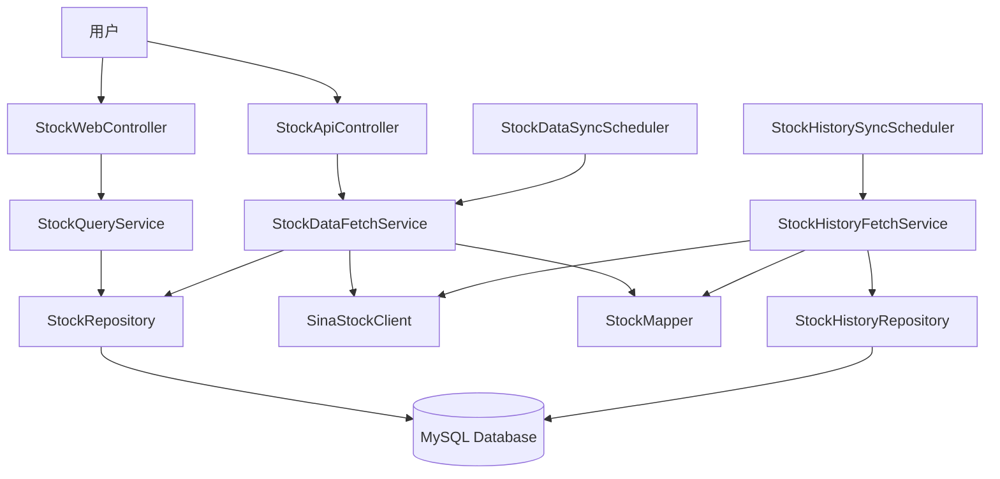
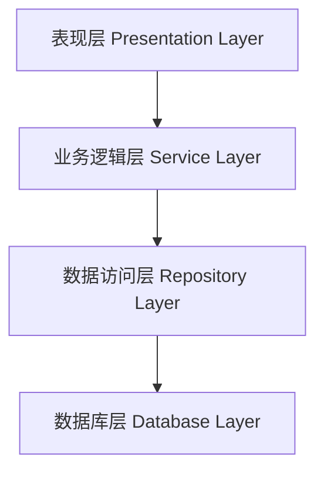
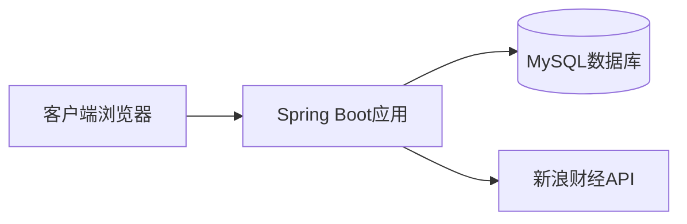

# 股票数据管理系统架构文档

## 系统架构图



## 项目概览

股票数据管理系统是一个基于Spring Boot 3.x开发的企业级应用，主要功能包括股票实时数据展示和历史数据获取。

### 核心功能
1. **股票数据展示**：通过Web界面分页展示股票实时行情
2. **数据自动同步**：定时从新浪财经API获取最新数据

## 技术架构

### 分层架构



### 技术栈
- **框架**: Spring Boot 3.4.3
- **ORM**: Spring Data JPA + Hibernate
- **数据库**: MySQL 8.0
- **模板引擎**: Thymeleaf
- **对象映射**: MapStruct
- **工具库**: Lombok, FastJSON

## 核心模块说明

### 1. Controller层（表现层）

#### StockWebController
- **路径**: `/stocks`
- **职责**: 处理股票列表页面请求
- **功能**: 支持分页查询和按股票代码搜索

#### StockApiController
- **路径**: `/api/stocks`
- **职责**: 提供REST API接口
- **功能**: 手动触发数据同步

### 2. Service层（业务逻辑层）

#### StockQueryService
- **职责**: 股票数据查询服务
- **功能**: 提供分页查询和搜索功能

#### StockDataFetchService
- **职责**: 股票实时数据获取服务
- **功能**: 从新浪财经API获取股票实时数据并保存到数据库

#### StockHistoryFetchService
- **职责**: 股票历史数据获取服务
- **功能**: 批量获取所有股票的历史K线数据

### 3. Repository层（数据访问层）

#### StockRepository
- **职责**: 股票实时数据仓库
- **功能**: 
  - 基本的CRUD操作
  - 自定义upsert操作（插入或更新）
  - 按股票代码模糊查询

#### StockHistoryRepository
- **职责**: 股票历史数据仓库
- **功能**:
  - 基本的CRUD操作
  - 批量插入历史数据
  - 自定义查询操作

### 4. Scheduler层（定时任务）

#### StockDataSyncScheduler
- **执行时间**: 每天3:10
- **职责**: 定时同步股票实时数据

#### StockHistorySyncScheduler
- **执行时间**: 每天16:30
- **职责**: 定时同步股票历史数据

### 5. 外部集成

#### SinaStockClient
- **职责**: 新浪财经API客户端
- **功能**:
  - 获取股票实时数据
  - 获取股票历史K线数据

## 数据模型

### Stock（股票实体）
```java
- id: 主键
- symbol: 股票唯一标识（如sh600000）
- code: 股票代码（如600000）
- name: 股票名称
- tradePrice: 最新价
- priceChange: 涨跌额
- changePercent: 涨跌幅
- volume: 成交量
- amount: 成交金额
- 等其他交易指标...
```

### StockHistory（股票历史数据）
```java
- id: 主键
- symbol: 股票唯一标识
- code: 股票代码
- day: 交易日期
- open: 开盘价
- high: 最高价
- low: 最低价
- close: 收盘价
- volume: 成交量
- 均线数据...
```

## 配置说明

### 线程池配置
- **核心线程数**: 2
- **最大线程数**: 5
- **队列容量**: 100
- **用途**: 异步执行定时任务

### 数据库配置
- **连接池**: HikariCP
- **JPA策略**: update（自动更新表结构）

## 部署架构



## 优化亮点

1. **清晰的职责划分**：Controller、Service、Repository各司其职
2. **规范的命名**：类名和方法名准确描述业务功能
3. **现代化的依赖注入**：统一使用构造函数注入
4. **高效的数据处理**：批量操作提升性能
5. **完善的异常处理**：合理的错误处理机制

## 扩展性设计

- **易于添加新的数据源**：通过实现Client接口
- **易于扩展新的查询功能**：在Service层添加新方法
- **易于支持新的股票指标**：扩展实体类字段
- **易于集成缓存**：Service层可快速集成Redis

## 性能优化

- 使用JPA批量操作减少数据库交互
- 使用JDBC批处理提升插入性能
- 使用HikariCP连接池管理数据库连接
- 异步执行定时任务避免阻塞

## 安全考虑

- 使用参数化查询防止SQL注入
- 合理的异常处理避免信息泄露
- 数据库密码配置化管理
