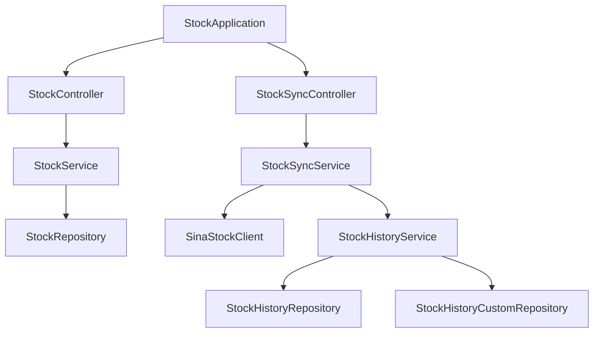

# 股票系统架构文档

## 技术栈
- **后端框架**: Spring Boot 3.4.3
- **数据库**: MySQL (通过 JDBC 和 JPA 访问)
- **构建工具**: Maven
- **Java 版本**: 17
- **其他依赖**: 
  - Lombok (简化代码)
  - MapStruct (对象映射)
  - FastJSON (JSON 处理)
  - Apache HttpClient (HTTP 客户端)
  - Thymeleaf (模板引擎)

## 模块划分

### 1. 核心模块
- **启动类**: `StockApplication` - Spring Boot应用程序入口点
- **配置类**: 
  - `ExecutorConfig` (线程池配置) - 配置用于股票数据同步的线程池
  - `RestTemplateConfig` (HTTP 客户端配置) - 配置用于HTTP请求的RestTemplate实例

### 2. 控制器层
- `StockController`: 股票数据接口 - 处理股票数据相关的HTTP请求
- `StockSyncController`: 股票数据同步接口 - 提供股票数据同步相关的REST API接口
- `TestController`: 测试接口 - 提供简单的测试接口，用于验证应用程序是否正常运行

### 3. 服务层
- `StockService`: 股票数据服务 - 提供股票数据相关的业务逻辑处理
- `StockSyncService`: 股票数据同步服务 - 提供从新浪财经API同步股票数据到本地数据库的功能
- `StockHistoryService`: 股票历史数据服务 - 提供股票历史数据的获取和保存功能

### 4. 数据访问层
- **实体类**: 
  - `StockEntity` - 股票实时数据实体类
  - `StockHistory` - 股票历史数据实体类
- **DTO**: 
  - `StockDTO` - 股票实时数据传输对象
  - `StockHistoryDTO` - 股票历史数据传输对象
- **仓库接口**: 
  - `StockRepository` - 股票数据仓库接口
  - `StockHistoryRepository` - 股票历史数据仓库接口
  - `StockHistoryCustomRepository` (自定义查询) - 股票历史数据自定义仓库接口

### 5. 调度任务
- `StockSyncScheduler`: 股票数据同步任务 - 负责定时触发股票数据的同步任务
- `StockHistoryScheduler`: 股票历史数据任务 - 负责定时触发股票历史数据的同步任务

### 6. 工具类
- `MyStringUtil`: 字符串处理工具 - 提供字符串处理相关的工具方法

### 7. 外部服务集成
- `SinaStockClient`: 新浪股票数据客户端 - 用于从新浪财经API获取股票实时数据和历史数据

## 架构图

## 数据流
1. 用户通过 `StockController` 或 `StockSyncController` 发起请求。
2. 控制器调用对应的服务层 (`StockService` 或 `StockSyncService`)。
3. 服务层通过 `StockRepository` 或 `SinaStockClient` 获取数据。
4. 数据经过处理后返回给用户或存储到数据库。

## 后续优化建议
1. 引入缓存机制 (如 Redis) 提升性能。
2. 增加 API 文档 (如 Swagger)。
3. 完善单元测试和集成测试。